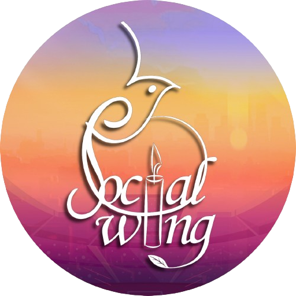

 

# Social Wing Website (SOW)

Welcome to the official repository for the **Social Wing Website**, a platform dedicated to supporting the initiatives and activities of the **Social Wing of RAIT** (Ramrao Adik Institute of Technology). The Social Wing is a student-driven committee focused on creating a positive impact through various social causes, campaigns, and events.

---

## 🌟 About the Social Wing

The **Social Wing of RAIT** is committed to driving change and fostering social responsibility among students and the larger community. Our initiatives range from:
- 🩸 **Blood Donation Drives**: Saving lives through regular blood donation campaigns.
- 🌿 **Environmental Campaigns**: Promoting sustainability and environmental awareness.
- 📚 **Educational Outreach**: Supporting underprivileged students in their educational journey.
- 🧠 **Mental Health Awareness**: Encouraging open conversations about mental well-being.

### 🎯 **Our Vision**
To empower students and the community to take proactive steps toward societal betterment.

### 🌍 **Our Mission**
- Bridge the gap between privileged and underprivileged communities.
- Encourage youth participation in social welfare activities.
- Spread awareness about critical societal issues.

---

## 🖥️ Features of the Website

- **About Us Section**: Learn about our mission, vision, and history.
- **Event Updates**: Stay informed about upcoming events and campaigns.
- **Volunteer Opportunities**: Join hands with us to make a difference.
- **Contact Us**: Easily reach out for collaborations or queries.

---

## 🚀 Getting Started

This project was bootstrapped with [Create React App](https://github.com/facebook/create-react-app). Follow these steps to set up and run the project locally.

### 📋 Prerequisites
- **Node.js** (v16 or later recommended)
- **npm** or **yarn**

### ⚙️ Installation
1. Clone the repository:
   ```bash
   git clone https://github.com/Pratham-Vishwkarma/Social-Wing-Website.git
   cd Social-Wing-Website
   ```

2. Install dependencies:
   ```bash
   npm install
   ```

### ▶️ Available Scripts

In the project directory, you can run:

#### `npm start`
- Starts the app in development mode.  
- Open [http://localhost:3000](http://localhost:3000) to view it in your browser.

#### `npm test`
- Launches the test runner in interactive watch mode.

#### `npm run build`
- Builds the app for production to the `build` folder.  
- Optimized for best performance and ready for deployment.

---

## 🤝 Contributing

We welcome contributions to enhance the Social Wing Website! Here's how you can contribute:

1. **Fork the repository**:
   ```bash
   git fork https://github.com/Pratham-Vishwkarma/Social-Wing-Website.git
   ```

2. **Create a new branch**:
   ```bash
   git checkout -b feature/your-feature-name
   ```

3. **Commit your changes**:
   ```bash
   git commit -m "Add your message here"
   ```

4. **Push and create a pull request**.

---

## 📜 License

This project is licensed under the **MIT License**. For more details, see the [LICENSE](LICENSE) file.

---

## 📞 Contact

For any inquiries or to learn more about the **Social Wing of RAIT**, connect with us:

- 🌐 **Official Website**: [Social Wing RAIT](https://socialwingrait.com/)
- 📧 **Email**: socialwing@rait.ac.in  